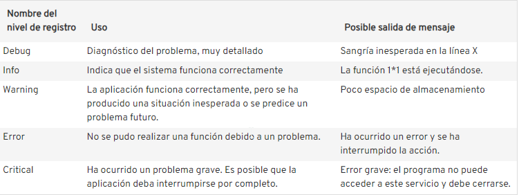

## Librerias

Para manejar el loggueo de errores Python dispone de la libreria logging.

```python
import logging
```
# Manejo de Logs

El manejo d eLogs nos ayuda a identificar el comportamiento de la aplicacion.

Existen diferentes niveles de debugging:
- Debug
- Info
- Warning
- Error
- Critical

| **Tarea**      |  **Metodos**            |   | 
-------------|-----------------------------|---
Mostrar salidas de la consola para el uso ordinario de un programa o guión (script) de línea de comandos  | print() |
Reportar eventos que ocurren durante el funcionamiento normal de un programa (por ejemplo, para la supervisión del estado o la investigación de fallos) | Los métodos info() o debug podrian ser empleados para esta tarea | 
Emitir una advertencia con respecto a un evento de tiempo de ejecución en particular | warnings.warn() en el código de la biblioteca si el problema es evitable y la aplicación cliente debe ser modificada para eliminar la advertencia |
Reportar un error con respecto a un evento particular al tiempo de ejecución | Lanza una excepción | 
Reporta la supresión de un error sin invocar una excepción (por ejemplo, el manejador de errores en un proceso de servidor de larga duración) | Los siguientes metodos podrian ser empleado:  error(),execption() o Critical | 


 

### Componentes de la libreria logging:

El módulo logging de Python forma parte de la biblioteca de Python. Por lo tanto, la interfaz de logging no solo interactúa con fluidez con el resto del código fuente, sino que también está siempre lista para usar. Gracias al handler, es posible incorporar rápidamente al código existente los registros simples y el envío de información a un archivo. Además, el módulo logging de Python tiene características adicionales que permiten personalizar la herramienta. Estos son los componentes principales del módulo logging:

- Logger.
- Handlers.
- Formaters.

#### Logger:
Los loggers resgistran las acciones durante la ejecucion de un programaa. Sin embargo, pueden ser utilizados diractamente, normalmente son asignados a una variable logger haciendo uso de la la fucioncion *logging.getlogger(«nombre_del_logger»)*

#### Handler:
Los handlers recopilan la informacion de looger y la reenvian


<cite>Tomado de https://www.toptal.com/python/in-depth-python-logging </cite>

##### Handlers mas comunes y sus usos:
- **StreamHandler**: envia la información en Consola.
- **FileHandler**: envia la información a un archivo.
- **SMTPHandler**: envia la información via correo Electronico.

Puede consultar todas las possibles variantes en el siguiente [enlace](https://docs.python.org/3/library/logging.handlers.html)

### Formaters:
Se utilzan para darle mas contexto al mensaje, se valen de «%()s» para insertar variables de visualizaicon en el mensaje:
El siguiente es un ejemple de un formatter en python:
```python
formatter=logging.Formatter("%(asctime)s — %(name)s — %(levelname)s — %(funcName)s:%(lineno)d — %(message)s")
```
output
```bash
2024-02-07 19:47:41,864 - a.b.c - WARNING - <module>:1 - hello world
```

<cite> Tomando de https://www.toptal.com/python/in-depth-python-logging</cite>

### Ejemplo

```python
import logging
logging.warning('Atento.!!')  
logging.info('Te lo dije.!!')  
```

En el ejemplo anterio el mensaje *«Te lo dije.!!»* no se muestra en pantalla debido a que el nivel de logueo por defecto es *«Warning»*.


### Creando archivos de configuracion para loggeo

Se puede configurar el logue de 3 maneras:
1. Creando *loggers*, *Handlers*,  y *Formaters* 


```bash
[loggers]
keys = root

[handlers]
keys = file , screen

[formatters]
keys = simple , verbose

[logger_root]
level=DEBUG
handlers = file , screen

[handler_file]
class = FileHandler
level=DEBUG
formatter=simple
args=(os.getcwd() + f'./logging/config_file/logs/config_Update_{time.strftime("%%Y%%m%%d%%H%%M%%S")}.log', 'a', 'utf-8')

[handler_screen]
class=StreamHandler
level=DEBUG
formatter=verbose
args = (sys.stdout,)

[formatter_simple]
format=%(asctime)s %(levelname)s : %(message)s


[formatter_verbose]
format=%(asctime)s %(levelname)s %(name)s %(module)s %(funcName)s %(process)d : %(message)s

```


# Referencias:


Vinay Sajip. (2024). Logging HOWTO — Python 3.12.3 documentation. https://docs.python.org/3/howto/logging.html

Abhinav Ajitsaria. (2018, July 12). Logging in Python – Real Python. https://realpython.com/python-logging/

docs.python. (n.d.-a). logging — Logging facility for Python — documentación de Python - 3.12.3. Retrieved June 3, 2024, from https://docs.python.org/es/3/library/logging.html

docs.python. (n.d.-b). logging.handlers — Logging handlers — Python 3.12.3 documentation. Retrieved June 3, 2024, from https://docs.python.org/3/library/logging.handlers.html

IONOS. (2023, February 1). El módulo logging de Python: así funciona logging to file - IONOS. https://www.ionos.com/es-us/digitalguide/paginas-web/desarrollo-web/logging-de-python/

Son Nguyen Kim. (n.d.). Python Logging: In-Depth Tutorial | Toptal®. Retrieved June 3, 2024, from https://www.toptal.com/python/in-depth-python-logging
