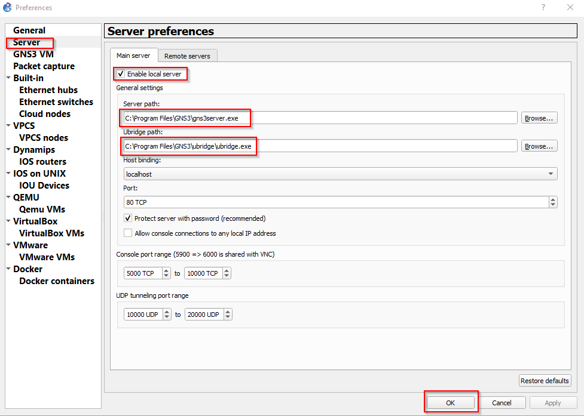
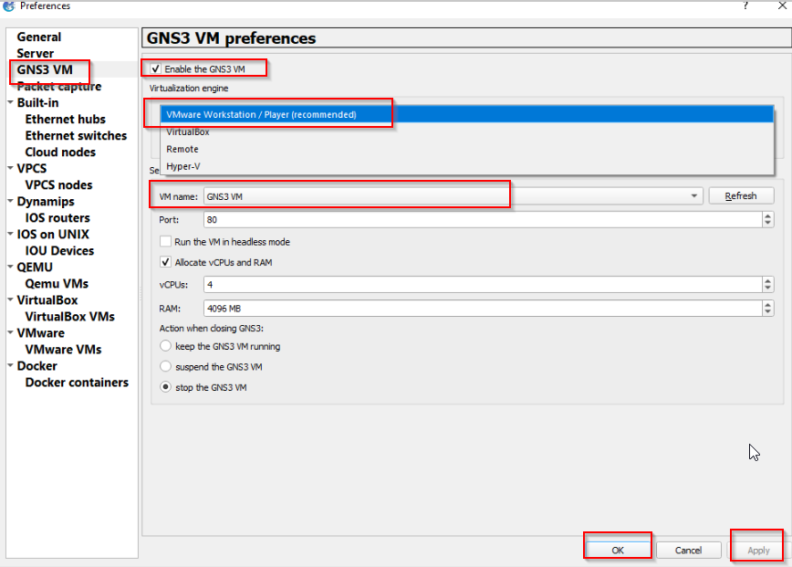

# GNS 3 setup
## Descargar e Importar GNS3 VM en VMware Workstation

Descargar la VM de GNS3 en el siguiente enlace

Abra VMware Workstation.
Click a File > Open y selecciona el archivo .ova descargado de la VM de GNS3.
Sigue las instrucciones para importar la VM.

## Descargar e Instalar GNS3
1. Descargar GNS3:

    - Abra al sitio web oficial de GNS3: https://www.gns3.com/software/download
    - Descarga el instalador para Windows.
2. Instalar GNS3:

    - Ejecute el instalador descargado.
    - Sigua las instrucciones del asistente de instalación para instalar GNS3 y todas sus dependencias.
    - Asegúrese de seleccionar la opción para instalar el "GNS3 VM" cuando se te pregunte.
## Configurar la Máquina Virtual de GNS3

1. Arranque la maquina virtual desde vmware.
2. Ejecute GNS3
3. Habilite local server:
    - Click a Edit > Preferences > Server.
    - Click *Enable Local Server*:
        - Server path = C:\Program Files\GNS3\gns3server.exe
        - Ubridge path= C:\Program Files\GNS3\ubridge\ubridge.exe
        - Host binding = localhost

    
4.  Configurar la GNS3 VM:
    - clieck en Edit > Preferences.
    - En GNS3 VM, selecciona Enable the GNS3 VM.
    - Asegúrese de que el tipo de máquina virtual está configurado como VMware Workstation.
    - En VM name, seleccione la VM de GNS3 que importaste anteriormente.
    - Haga clic en Test Settings para verificar que GNS3 puede comunicarse con la VM.
    
    