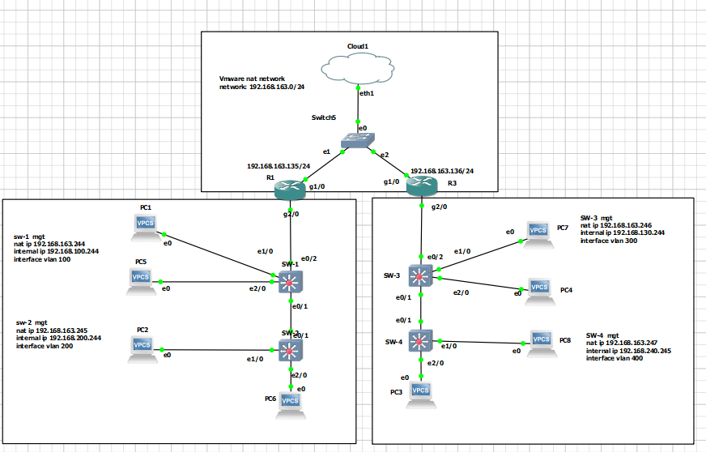

# Proyecto

## Requisitos 
- PC con Windows
- VMware Workstation Pro
- GNS3
- Configuración de ambiente en VMware


La siguiente [guía](./vmware.md) ofrece un paso a paso sobre como configrar el ambiente en vmware.

La siguiente [guía](./GNS3.md) ofrece los pasos para configurar GNS3 utilizan un ova para vmware y configurando GNS3 VM.

Descargue e importe el siguiente [proyecto](https://crgworkforce-my.sharepoint.com/:u:/g/personal/rreyes_getcrg_com/EYREOkL19cBKkml4z1tCHuMBog4TtXksNcw2CH34oFZ9QA?e=dBBqjW) a su GNS3 


## Tópicos

La intención de este proyecto es practicar las habilidades estudiadas durante el curso.

Se realizará un repaso de los siguientes temas:

- Manejo seguro de credenciales / cifrado asimétrico de archivos.
- Regex.
- Pandas - Dataframes.
- Logging.
- Archivos de configuración.
- Netmiko. 

Topología del proyecto:


## Netmiko.

Para este punto es necesario crear un módulo con el cual se estarán conectando a los equipos de red mediante la librería Netmiko.

En el directorio <a href="./suplementos"> sumplementos </a>  podrá encontrar los siguientes insumos: 

- Inventario con direcciones IP de los equipos
- Llave privada para descifrar el archivo de credenciales
- Credenciales, archivo encriptado que contiene las credenciales SSH de los equipos en el inventario. El archivo de credenciales contiene el siguiente formato: 


## Pasos para la resolución

- Cree una rutina para descifrar el archivo encriptado con las credenciales.
- Inicie una rutina de Logging:
    - Cree un archivo de configuración (logging.conf) que contenga todos los parámetros necesarios para registrar mensajes en archivos y en la terminal.
    - Inicie el logging en una función utilizando el archivo de configuración y la librería configparser. Asegúrese de que la configuración incluya niveles de registro apropiados, formatos de mensaje y manejadores (handlers) para archivos y terminal.
    - Puede consultar el siguiente [enlace](https://github.com/redu-reyesd/python/tree/main/Sesion%203/Logging)

- Importe el archivo CSV a Python como CSV
    ```python
        import csv
        inventario = pd.read_csv(csv_file,usecols=[0,1],
                    names=['ip','Pais'],header=0)
    ```
- Desarrolle una rutina en Netmiko capaz de crear y devolver una conexión SSH. Para reutilizar el código, desarrolle la rutina en un módulo aparte dentro del subdirectorio sub_modules. Ejemplo de la estructura del directorio:


- Cree un archivo para las configuraciones de los switches con los siguientes parámetros:
    -  Configurar todas las interfaces de los switches en modo full duplex; todas son Ethernet (puede utilizar REGEX para crear una lista de interfaces a recorrer).
    -  Configuración de VLAN: 
        - Asignar interfaces del rango 2/1 - 3 a la VLAN 200 en el switch 1.
        - Asignar interfaces del rango 2/1 - 3 a la VLAN 400 en el switch 3.
    - Apague todas las interfaces que no están en uso (*tip: pueden ser identificadas como todas las interfaces sin descripción*)
    *Nota, en este [enlace](https://github.com/redu-reyesd/python/blob/main/Sesion%204/cfg.py) puede leer un archivo cfg*
    Ejemplo archivo CFG:
    ```bash
    [config]
    sw1 =  interface range ethernet 2/1 - 3
            switch port mode access vlan 200 
    sw3 =  interface range ethernet 2/1 - 3
            switch port mode access vlan 400
    int_mode = duplex full
    ```
## Reporte

Realice un reporte en un archivo CSV que contenga los siguientes datos: nombre del equipo, IP de gestión, interfaz, estado de la interfaz (Up/Down), VLAN.


Ejemplo:
| Nombre del Switch | Management IP    | Interfaz    | Estado | VLAN ID |
|-------------------|------------------|-------------|--------|---------|
| SW1               | 192.168.100.244  | Ethernet0/0 | Down   | 100     |
| SW1               | 192.168.100.244  | Ethernet0/1 | Up     | 100     |
| SW1               | 192.168.100.244  | Ethernet0/2 | Up     | 100     |
| SW1               | 192.168.100.244  | Ethernet0/3 | Down   | 100     |


