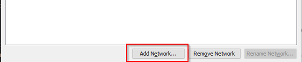
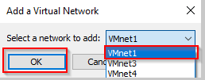
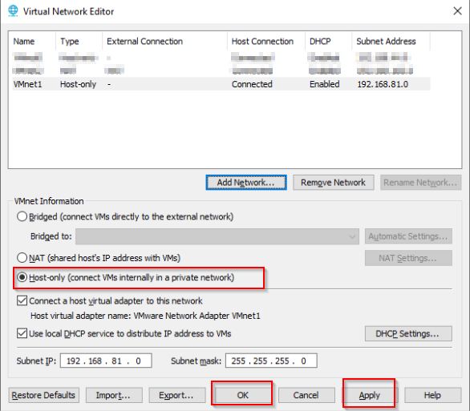
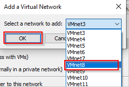
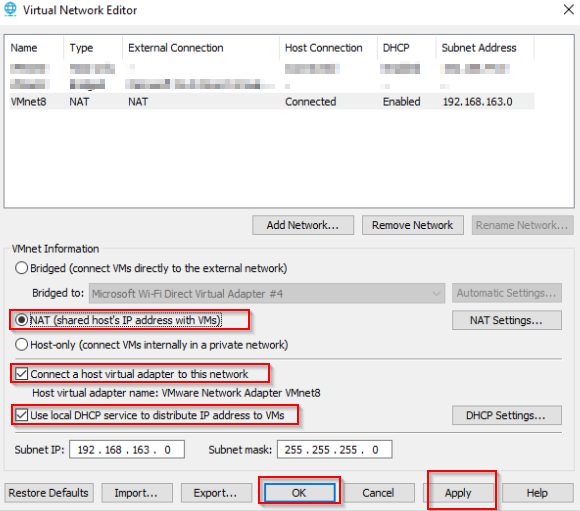
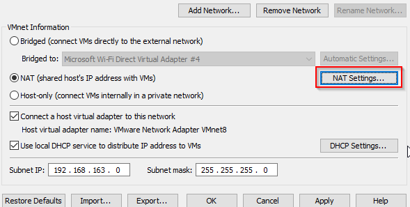
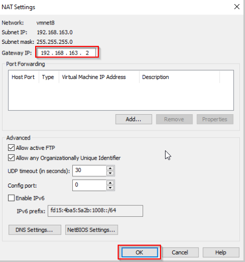
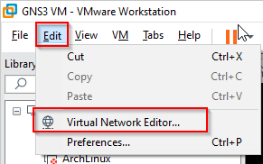
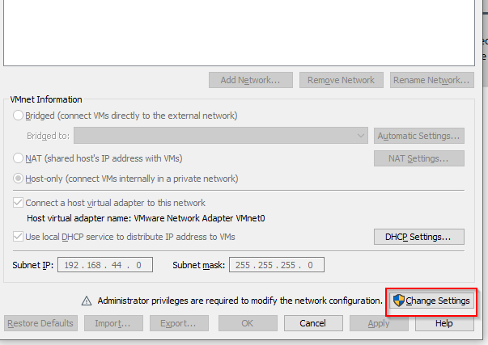

## Cofigurando ambiente en vmware

Este laboratorio require la creacion de dos redes en en vmware. 
-   Red **Host-Only** Una de las redes debeesta configurada como *Host-Only*. 
- Red **Nat** la otra debes estar configurada como NAT con la siguiente direccion de read 192.168.163.0/24 

Siga los siguientes pasos para poder cinfigurar la red.

## Configuración de la red Host-Only
1.  Abrir VMware Workstation:

- Inicia VMware Workstation en tu PC con Windows.
2. Acceder a las configuraciones de red:

    - En la barra de menú, selecciona Edit > Virtual Network Editor.
3. Seleccionar la red Host-Only:

    - En el Virtual Network Editor, busca la red VMnet1. Esta red suele estar configurada como Host-Only por defecto.
    - Si no existe, entonces siga los siguientes pasos:
        - Seleccione *Add Network*: 
         
        - Seleccione vnet1 y click en ok 
        
        - seleccion Host-Only, luego apply y ok: 
        
        
3. Verificar y configurar la red Host-Only:

    - Asegúrate de que la red VMnet1 está configurada como Host-Only.
    - Haz clic en la red VMnet1 y verifica las configuraciones. Debe estar marcada la opción Host-Only (Connects the virtual machine to a network that is accessible only to the host).
    - Si necesitas ajustar la configuración de IP, haz clic en DHCP Settings para configurar el rango de direcciones IP asignadas por DHCP, o bien puedes deshabilitar DHCP y asignar las IPs manualmente en tus máquinas virtuales.
    

## Configuración de la red NAT

1. Seleccionar la red NAT:

    - En el Virtual Network Editor, busca la red VMnet8. Esta red suele estar configurada como NAT por defecto.

2. Configurar la red NAT:

    - Haz clic en la red VMnet8 y asegúrate de que está configurada como NAT.
    - Haz clic en NAT Settings para ajustar la configuración de la red.
3. Configurar la dirección de la red NAT:

    - En la ventana de NAT Settings, configura la red con la dirección 192.168.163.0/24.
    - Establece la Gateway IP dentro de este rango, por ejemplo, 192.168.163.2.
    - Asegúrate de que el servidor DHCP está configurado para proporcionar direcciones IP dentro de este rango. Haz clic en DHCP Settings y configura el rango de direcciones IP asignadas por DHCP, por ejemplo, desde 192.168.163.3 hasta 192.168.163.254.
    - Si no existiese siga los siguientes pasos:
        - Seleccione *Add Network*: 
         
        - Seleccione vnet8 y click en ok 
        
        - seleccion NAT
        - *Coonnect a host to virtual adapter to this network*
        -  *Use local DHCP service to distribute IP address to VMs*
        - Luego apply y ok: 
        
        - Verifique que el gateway de la red:
            - Click en *Nat Settings*: 
             
            - Asegurese de que el gateway es 192.168.163.2:
            
            *Nota: si la direccion no es 192.168.163.2, corrija la direccion para que sea la direccion 192.168.163.2*

## Asignar Redes a Adaptadores en la Máquina Virtual
1. Abrir la configuración de la máquina virtual:

    - Selecciona la máquina virtual a la que deseas agregar las redes y haz clic en Settings.
2. Agregar red Host-Only al Adaptador 1:

    - En la ventana de configuración, selecciona Network Adapter bajo Device.
    - Marca la casilla Connected.
    - Selecciona la opción Custom: Specific virtual network.
    - En el menú desplegable, selecciona VMnet1 (Host-Only).
2. Agregar red NAT al Adaptador 2:

    - En la ventana de configuración, haz clic en Add para agregar otro adaptador de red.
    - Selecciona Network Adapter y haz clic en Finish.
    - Marca la casilla Connected.
    - Selecciona la opción Custom: Specific virtual network.
    - En el menú desplegable, selecciona VMnet8 (NAT).

## Ejemplo visual
1. Editar la Red Virtual
    -        

2. Configurar VMnet1
    - 
    - 

3. Configurar VMnet8

Espero que esto te sea de ayuda. Si tienes alguna pregunta adicional o necesitas más detalles, ¡déjame saber!